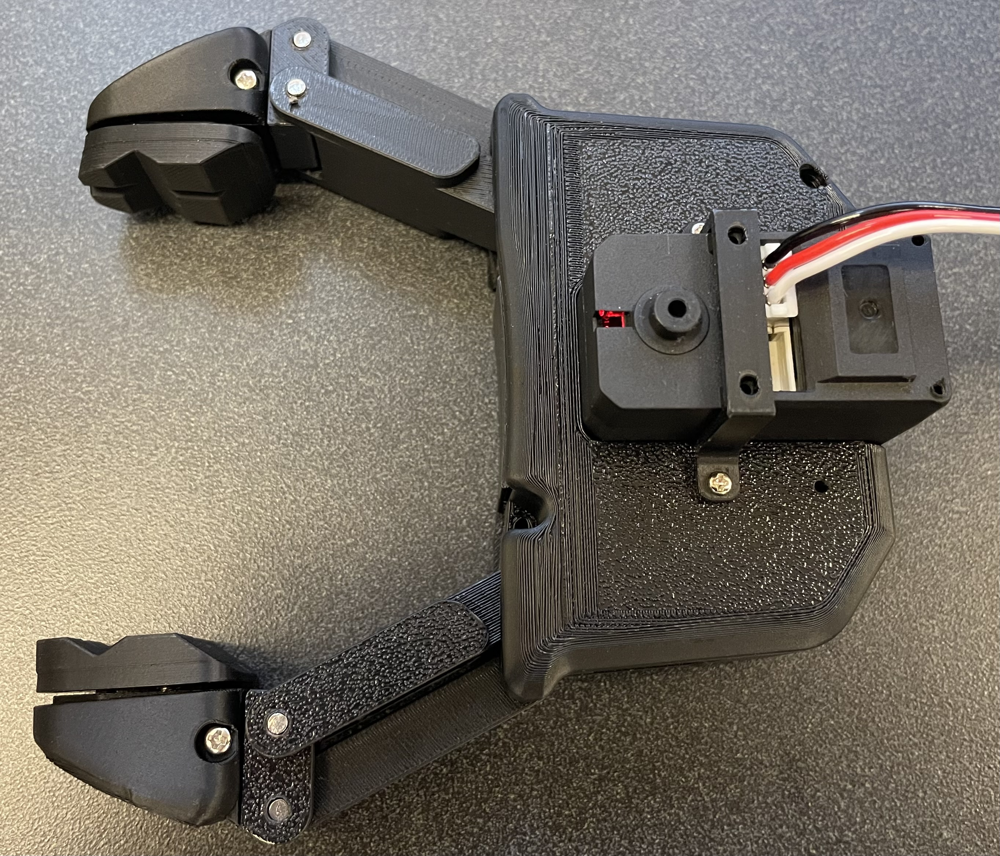
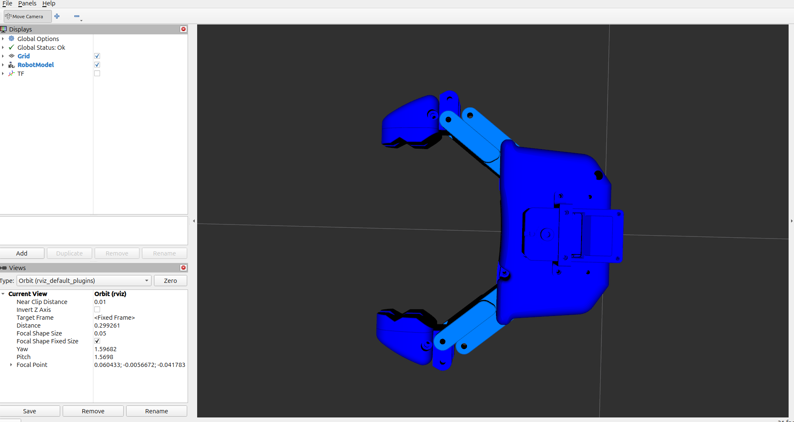
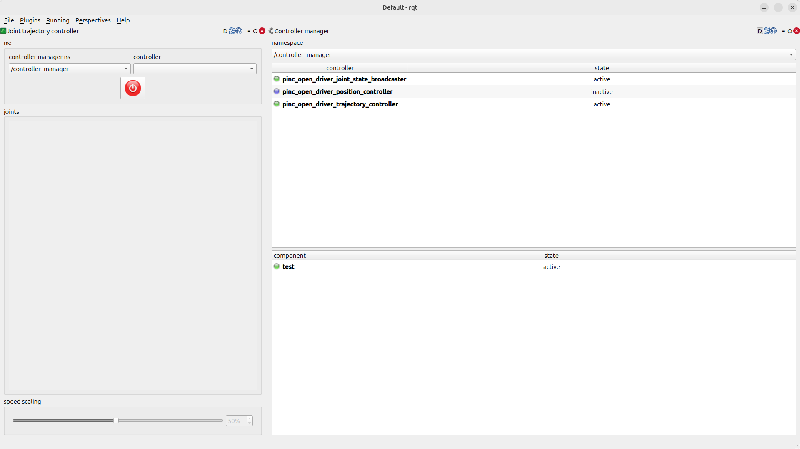
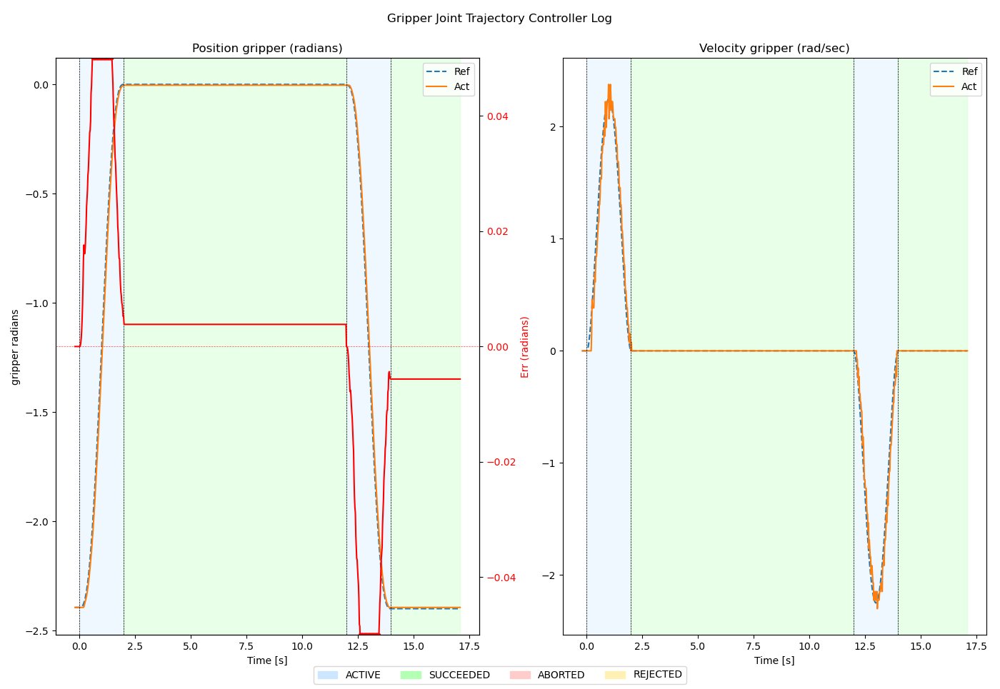

# PincOpen Driver

**pinc_open_driver** allows users to switch between a mock interface and the actual hardware of
 Pollen Robotics' open-source [PincOpen Gripper](https://pollen-robotics.github.io/PincOpen/ "PincOpen Gripper") gripper,
 actuated by a Robotis Dynamixel XM430-W210-R servo through ROBOTIS' `dynamixel_hardware_interface` ros2_control plugin.
 It includes a simplified URDF based on the PincOpen Gripper design which allows users to
 incorporate this gripper into their existing robot URDF.
 It also provides a YAML file that sets up two controllers: **position_controllers** and **joint_trajectory_controller**.
The package enables development and testing with either simulated or physical hardware.
It integrates with **ros2_control** and supports easy switching between modes.

<p align="center">
  
  
</p>

## Repository Layout

This repository is a self-contained workspace of four ROS 2 packages, so it can be added as a
single submodule of a larger project. The Dynamixel dependencies are git submodules pinned to
their `jazzy` branches.

| Path | Description |
|------|-------------|
| `pinc_open_driver/` | Gripper URDF, controller configuration, launch files, and helper scripts |
| `DynamixelSDK/` | ROBOTIS DynamixelSDK (provides `dynamixel_sdk`) |
| `dynamixel_interfaces/` | ROBOTIS message and service definitions |
| `dynamixel_hardware_interface/` | ROBOTIS ros2_control hardware plugin |

Clone with submodules (or initialize them after cloning, or after adding this repo as a submodule):

```bash
git clone --recursive https://github.com/Goddard-Technologies-LLC/Goddard-PincOpen-ROS2-Driver.git
# or
git submodule update --init --recursive
```

colcon discovers all four packages recursively, so a single `colcon build` from your workspace builds them.
If your workspace already provides any of the Dynamixel packages (e.g. from apt), place an empty
`COLCON_IGNORE` file in the redundant submodule directory to avoid duplicate package errors.

## Getting Started

Launch one (and only one) of these three launches

### Display Launch
* The display launch loads the robot description and uses the joint_state_publisher_gui to send
commands to the visualized model.
```
clear; ros2 launch pinc_open_driver display_gripper.launch.py
```

> Note: The URDF includes a simplified link model and does not model the exact kinematic 4-bar linkage.


### Mock Launch
* The mock launch activates the controllers and simulates the hardware.
The default controller activates is the joint_trajectory_controller commands can be sent via command line, using joint_trajectory_controller_gui via rqt, or our simple gui described below.

```
clear; ros2 launch pinc_open_driver mock.launch.py
```

This activates the "mock" loop back interface with a RViz viewer.

### Hardware Launch

To use the hardware gripper, first set up the serial communications:

#### Serial Setup

On initial set up on a specific computer, navigate to the `pinc_open_driver/pinc_open_driver` package directory,
Then, copy the provided `udev` rules (written for a Robotis U2D2 adapter) to enable serial communication:

```bash
sudo cp 99-pinc-gripper.rules /etc/udev/rules.d
sudo udevadm control --reload-rules
sudo udevadm trigger
```

The udev rule is optional. Without it, pass the device explicitly, e.g.
`ros2 launch pinc_open_driver hardware.launch.py serial_port:=/dev/ttyUSB0`.

##### U2D2 latency timer (recommended)

The U2D2's USB latency timer defaults to 16 ms, which exceeds the driver's 20 ms read timeout and causes
frequent `SYNC_READ_FAIL` errors. Set it to 1 ms before launching (adjust `ttyUSB0` to match your device):

```bash
echo 1 | sudo tee /sys/bus/usb-serial/devices/ttyUSB0/latency_timer
```

This setting resets when the U2D2 is unplugged or the computer reboots, so repeat it as needed.

#### Hardware Launch

```
clear; ros2 launch pinc_open_driver hardware.launch.py
```

This activates the hardware driver and a RViz viewer.


### ros2_control Parameters

The following parameters configure the gripper hardware, communication settings,
and visualization defaults. All parameters may be overridden via the launch file.
See `launch/hardware.launch.py` for usage example.

| Parameter | Default | Description |
|-----------|---------|-------------|
| `use_mock_hardware` | `false` | If `true`, uses a mock hardware interface instead of communicating with the physical gripper. Useful for simulation and testing. |
| `prefix` | `pinc_open_` | Prefix applied to joint and link names. Allows multiple instances of the gripper to be spawned without name collisions. |
| `default_color_rgba` | `0.0 0.0 1.0 1.0` | Default RGBA color applied to gripper visual links. Values are in the range `[0.0, 1.0]`. |
| `default_linkage_color_rgba` | `0 0.5 1.0 1.0` | RGBA color applied to linkage components of the gripper model. |
| `default_tip_color_rgba` | `0.0 0.0 0.7 1.0` | RGBA color applied to the gripper tip components. |
| `baud_rate` | `57600` | Serial communication baud rate. Must match the servo configuration (XM430 factory default is 57600). |
| `serial_port` | `/dev/pinc-gripper` | Serial device used to communicate with the Dynamixel (`port_name` of the hardware plugin). |
| `error_timeout_ms` | `500` | Communication timeout in milliseconds before reporting an error. |
| `dxl_id` | `1` | Dynamixel ID of the gripper actuator on the bus. Must match the configured servo ID. |
| `operating_mode` | `3` | Dynamixel operating mode: `3` position control, `5` current-based position control. |

---
## ROS 2 controllers available for use

The provided demo includes set ups for both
- `JointTrajectoryController`(`pinc_open_driver_trajectory_controller`) default
- `JointGroupPositionController` (`pinc_open_driver_position_controller`)
* User can switch between controller using the controller manager plugin in rqt.
<p align="center">
  
</p>

By default, the Hardware and Mock launches activates the`pinc_open_driver_trajectory_controller` `JointTrajectoryController` interface.
Commands can be sent via command line, standard action interfaces, and `rqt` gui or our `pinc_open_driver_control_gui`.

The demonstration controllers are named based on the gripper prefix defined in the launch files.
These can be modified for other prefixes (e.g. `'left_'` and `'right_'`).

---

## Helper Scripts

A few simplified logging and plotting scripts are available for use during testing.

* `ros2 run pinc_open_driver pinc_open_driver_control_gui`

    Use sliders and buttons to set goal joint positions and then "send a trajectory".
    Note, this basic spline trajectory command works with the `JointTrajectoryController`,
    but does not perform collision checking.

* `ros2 run pinc_open_driver pinc_open_driver_monitor`

    This echos joint and controller statuses to terminal while also logging data to the `$WORKSPACE_ROOT/log/pinc_logs` folder.

    Use `Ctrl-c` to terminate and close the log file.

* `ros2 run pinc_open_driver plot_pinc_open_driver_log`

<p align="center">
  
</p>

  By default, this command plots the last file saved by `pinc_open_driver_monitor` in the `$WORKSPACE_ROOT/log/pinc_logs` folder.
  Optionally the user can specify the full path to a specific log file name to retrieve a log from an earlier time.

* Servo registers can be inspected and changed with the services exposed by `dynamixel_hardware_interface`
  (e.g. `get_dxl_data`, `set_dxl_data`, `reboot_dxl`, `set_dxl_torque`) or with Dynamixel Wizard 2.0.

> Note: These basic helper scripts currently have hard coded topic names, and may need to be modified for your use case.


